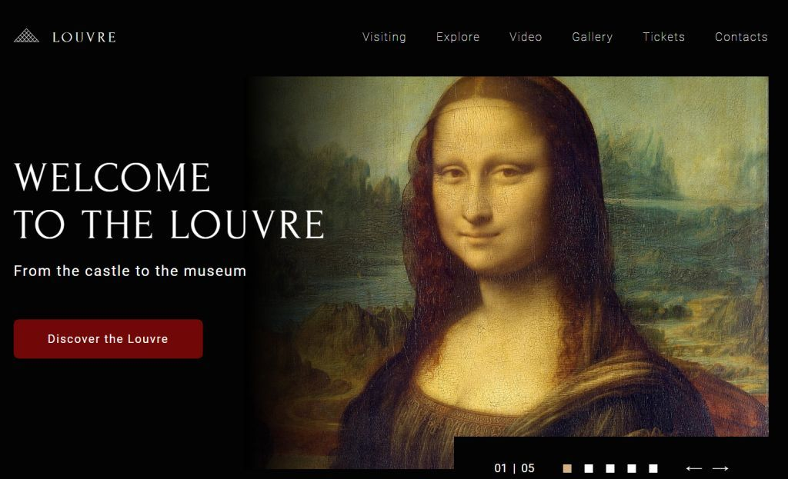
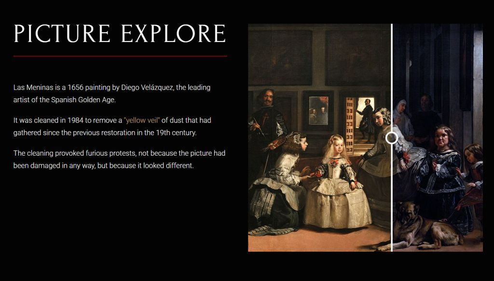
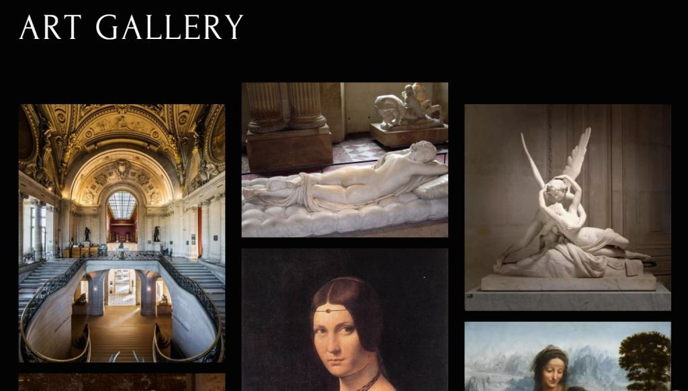
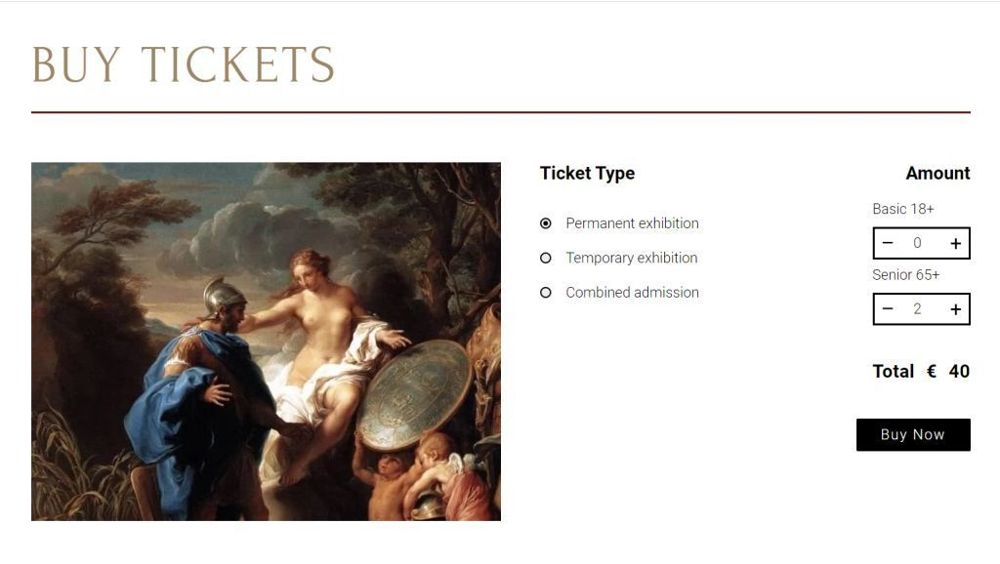
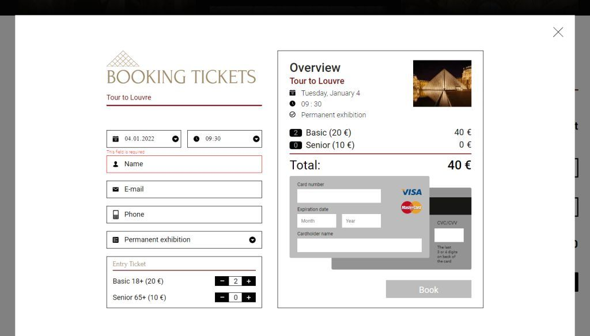
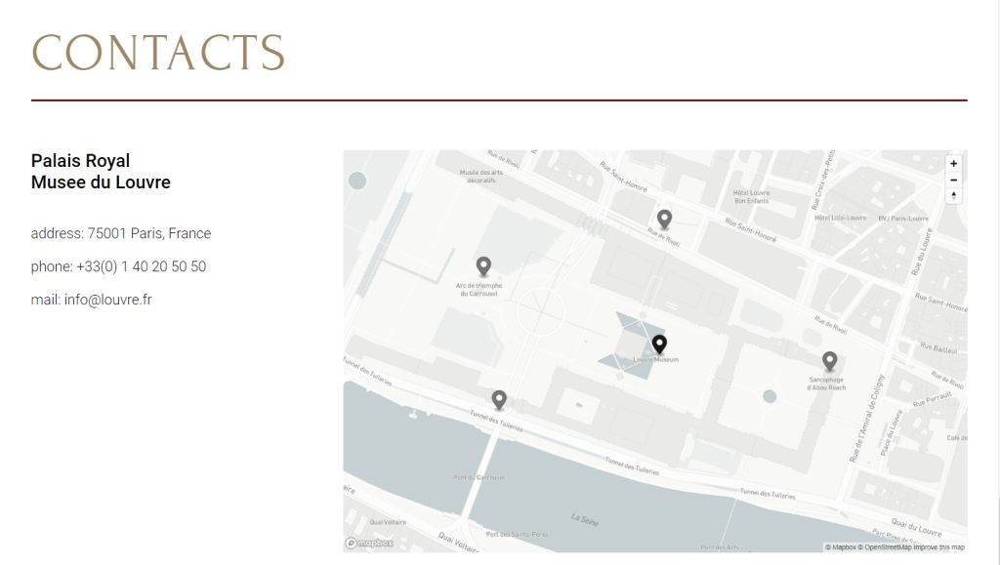

# Museum Task for RS School / HTML and CSS part - ready, JS - in progress

[**Website Link >**](https://ustyuzhanina.github.io/museum-louvre/)

This is a task aimed at thorough practicing flexible and adaptive markup combined with a good deal of Javascript code. 
Below you will find a short functional descripton of every section of the website.

---

Your comments and advice are always welcome at elena.ustyuzhanina.rus@gmail.com

---

## 1. **Section Welcome** / *Done*

- you can change pictures by clicking on left/right arrow buttons [+]
- you can swipe pictures through mouse clicking or touch [+]
- you can change pictures by clicking on the square bullets [+]
- the animation is smooth and you can swipe pictures endlessly left and right [+]
- the active slide's bullet is highlighted [+]
- the active slide's order number is shown in the control panel [+]

---

## 2. **Section Explore** / *Done*

- you can drag the dividing bar horizontally [+]
- the dividing bar never goes beyond the picture side borders [+]
- on dragging from right to left the below picture smoothly shows up [+]
- on dragging from left to right the top picture smoothly shows up [+]
- on page renewal the dividing bar returns to its initial state [+]

---

## 3. **Section Video** / *TODO*

### 3.1. **Slider** / *TODO*

- при клике по самому слайду или кнопке Play в центре слайда, внутри слайда проигрывается видео с YouTube. Никакие изменения с основным видео при этом не происходят +2 [+]
- если видео с YouTube проигрывается, клик по кнопке Pause останавливает его проигрывание. Также проигрывание видео останавливается, если кликнуть по другому слайду или кнопке Play в центре другого слайда. В указанной ситуации другое видео должно запуститься, а текущее остановиться. Невозможно проигрывание нескольких YouTube видео одновременно +2
- если внутри слайда проигрывается видео с YouTube, клик по стрелке перелистывания слайдов или клик по буллету останавливает проигрывание видео +2 !
- есть возможность перелистывания слайдов влево и вправо кликами по стрелкам. Слайды перелистываются по одному, при этом также меняется основное видео +2
- есть возможность перелистывания слайдов кликами по буллетам (кружочки внизу слайдера), при этом также меняется основное видео +2
- слайды перелистываются плавно с анимацией смещения вправо или влево (для смены основного видео анимация смещения не требуется и не проверяется) [+]
- перелистывание слайдов бесконечное (зацикленное) [+]
- при перелистывании слайдов буллет активного слайда подсвечивается (выделяется стилем) [+]
- если основное видео проигрывалось при перелистывании слайдера, проигрывание видео останавливается, прогресс бар сдвигается к началу, иконки "Play" на панели управления и по центру видео меняются на первоначальные +2
- даже при частых кликах или свайпах нет ситуации, когда слайд после перелистывания находится не по центру, нет ситуации, когда видны одновременно два слайда [+]

### 3.2. **Custom Video Player** / *TODO*

- при клике по кнопке "Play" слева внизу на панели видео начинается проигрывание видео, иконка кнопки при этом меняется на "Pause", большая кнопка "Play" по центру видео исчезает. Повторный клик на кнопку останавливает проигрывание видео, иконка меняется на первоначальную, большая кнопка "Play" по центру видео снова отображается +4
- при клике по большой кнопке "Play" по центру видео, или при клике по самому видео, начинается проигрывание видео, иконка кнопки "Play" слева внизу на панели видео меняется на "Pause", большая кнопка "Play" по центру видео исчезает. Клик на видео, которое проигрывается, останавливает проигрывание видео, иконка кнопки "Play" слева внизу на панели видео меняется на первоначальную, большая кнопка "Play" по центру видео снова отображается +4
- прогресс-бар отображает прогресс проигрывания видео +2
- перетягивание ползунка прогресс-бара позволяет изменить время с которого проигрывается видео +2
- если прогресс-бар перетянуть до конца, видео останавливается, соответственно, меняется внешний вид кнопок "Play" +2
- при клике на иконку динамика происходит toggle звука и самой иконки (звук включается или выключается, соответственно изменяется иконка) +2
- при перемещении ползунка громкости звука изменяется громкость видео +2
если ползунок громкости звука перетянуть до 0, звук выключается, иконка динамика становится зачеркнутой +2
- если при выключенном динамике перетянуть ползунок громкости звука от 0, звук включается, иконка громкости перестаёт быть зачёркнутой +2
- при нажатии на кнопку fullscreen видео переходит в полноэкранный режим, при этом видео и панель управления разворачиваются во весь экран. При нажатии на кнопку fullscreen повторно видео выходит из полноэкранного режима. Нажатие на клавишу для выхода из полноэкранного режима Esc не проверяем и не оцениваем +2
- панель управления в полноэкранном режиме визуально выглядит так же, как на макете - кнопки равномерно распределены по всей ширине страницы, относительные размеры между кнопками и ползунками, а также относительные размеры самих кнопок остались прежними +2
- управление плеером с клавиатуры. Горячие клавиши должны работать так же, как работают эти клавиши в YouTube видео +10 Клавиши и группы клавиш работают в русской и английской раскладке клавиатуры. При изменении скорости воспроизведения поверх видео появляется и исчезает число с текущим коэффициентом воспроизведения, как это происходит в YouTube видео:
-клавиша Пробел — пауза, при повторном нажатии - play +2
-Клавиша M (англ) — отключение/включение звука +2
-Клавиша F — включение/выключение полноэкранного режима +2
-Клавиши SHIFT+, (англ) — ускорение воспроизведения ролика. +2
-Клавиши SHIFT+. (англ) — замедление воспроизведения ролика +2

---

## 4. **Section Gallery** / *Done*

- on page renewal the order of pictures changes [+]
- on page scrolling down the pictures come into view with animation: the images are smoothly elevated gradually growing. The animation example is at Louvre's website https://www.louvre.fr/ [+]
- if you scroll up and then start scrolling down again the animation will repeat [+]
-  on page renewal, if it was scrolled to the Section Gallery, the animation should repeat [+] 

---

## 5. **Section Tickets** / *Done*

- on changing quantity of the Basic/Senior tickets the total sum is recalculated [+]
- the ticket price chnages depending on the ticket type. On changing the ticket type the total price is recalculated. [+]
- on page renewal the form keeps showing the tickets' correct type, qty and the total sum [+]

---

## 6. **Booking Form** / *Done + pending error elimination*

### 6.1. **Calculator** / *Done*

- after clicking on 'Buy now' button, the booking form opens. The opened form already has the data chosen in the preliminary form from Section Tickets (tickets qty, type and the total cost) [+]
- when you choose the date on the left side, it shows up on the right side [+]
- you cannot choose the date fom the past [+]
- when you choose the time on the left side, it shows up on the right side [+]
- you can choose the time from 9:00 till 18:00 with a 30 minutes step [+]
- you can change the ticket type on the left. This will change the ticket type, ticket price and the total cost on the right side [+]
- you can change the tickets qty of each ticket type on the left. This will change the qty and the total cost on the right side [+]

### 6.2. **Form Validation** / *Done*

- the user's name is valid if it has 3-15 characters (letters of the English or Russian alphabet, upper and lower case and spaces) [+]
- email validation should pass only addresses of the following pattern: **username@example.com**, where **username** is a name consisting of 3-15 characters (leters, digits, underscore, hiphen), should have no spaces; **@** - special email symbol; **example** - domain name consisting of no less than 4 Latin letters; **com** - top-level domain consisting of no no less than 2 Latin letters and separated from the domain name with a dot [+]
- the phone number should consist of digits only, without separation or split into groups of 2 or 3 digits with spaces or hiphens. No more than 10 digits [+]
- in case of invalid input the field border is highlighted with red color and a clear error message shows up [+]

---

## 7. **Section Contacts** / *Done*

- the map is interactive [+]
- the map shows the markers located and styled in compliance with the design [+]
- the map is styled in compliance with the design [+]
